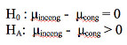
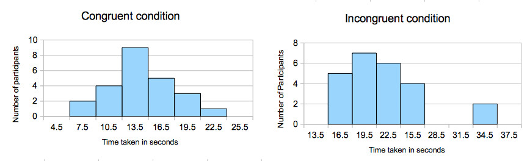

# Statistical analysis of the results of a Stroop Test

# Introduction
[Stroop Effect](http://en.wikipedia.org/wiki/Stroop_effect) studies the variation in reaction time to a task due to interference. One of the most common demonstration of this involves asking participants to name the color of the words shown to them. If the word is the same as the name of the color, the participants take much lesser time. However if the word is the name of a different color(e.g. the word RED written in BLUE ink to which the participant has to reply BLUE), the participants tend to take a long time. The effect is named after John Ridley Stroop, who first published it in 1935.

There is a psychological test called Stroop test that measures this effect. This notebook takes a dataset from this test and investigates the presence of the Stroop effect. A participant of this test has to name the colors of a series of word. The total time he takes to complete the entire series is noted. Participant is first shown list of **congruent words** and his total response time noted. These are words where the word and the color of the font are the same(e.g. RED written in RED for which the participant has to say RED). The same participant is shown a list of **incongruent words** and his total response time noted. These are words where the word and font color are different(e.g. the word BLUE written in RED to which the participant has to say RED). 

# Experiment
We conduct the above experiment. 
* The **independent variable** is the **congruency condition** of the words in the list(i.e. are they congruent or not). 
* The **dependent variable** is the total response time taken by the participant to read out the entire list. 
* Since the same participant takes both the conditions and we do not know the population parameters, we conduct a **dependent samples t-test with repeated measures design** to check on the hypothesis. 
* The **null hypothesis** is that the average time taken to read the list does not change due to congruency condition. i.e. the difference between the time taken will have an average of zero.
* The **alternate hypothesis** is that if the words are incongruent, the average time taken to read them is significantly more than when they are congruent. The average value of the difference(incongruent-congruent) will be larger than zero.



* We will check the effect for an **one tailed positive direction test**(incongruent minus congruent greater than zero) with an **alpha value** of 0.05.

# Data from the experiment
We have a dataset from a run on 24 participants. For each participant, we have response time for both congruent and incongruent set. Since the number is small, the entire data is shown below.

Congruent|Incongruent
---------|-----------
12.079|19.278
16.791|18.741
9.564|21.214
8.63|15.687
14.669|22.803
12.238|20.878
14.692|24.572
8.987|17.394
9.401|20.762
14.48|26.282
22.328|24.524
15.298|18.644
15.073|17.51
16.929|20.33
18.2|35.255
12.13|22.158
18.495|25.139
10.639|20.429
11.344|17.425
12.369|34.288
12.944|23.894
14.233|17.96
19.71|22.058
16.004|21.157

Here are the some descriptive statistics of the **congruent set**
```
Min : 8.63 seconds
Max : 22.32 seconds
Mean : 14.05 seconds
Std Dev: 3.55 seconds
```

Here are the same statistics of the **incongruent set**
```
Min : 15.68 seconds
Max : 35.25 seconds
Mean: 22.01 seconds
Std Dev: 4.79 seconds
```

Following is a histogram of the data in the two conditions. While the congruent condition plot looks like a normal distribution, the shape of the incongruent condition plot is obscured by the presence of an outlier. 



# Analysis

* The **average of difference in time**(Incongruent-Congruent) is around 7.96 seconds
* The **standard deviation** of the difference is 4.86 seconds.
* The **standard error** of the sample difference is 0.9930
* The **t-value** is 8.02
* The **t-critical** value for one-sided alpha value of 0.5 is 1.714. Since our t value is way more than the t-critical, the result is **statistically significant**. 
* Therefore we can **reject the null hypothesis** that the averages are the same. We accept the alternative hypothesis that the average time taken when the words are incongruent is more than when the words are congruent. The p value is less than .001
* The **cohen-d** value for the experiment is 1.63 
* The **r-squared** value of .7366 indicates that nearly three-quarters of the average time difference is due to the incongruent condition. 

# Conclusion
As shown above, we can conclude that when there is disagreement between the word specifying the color and the color of the letters, the participants take more time to identify the color of the letters than otherwise. Thus Stroop effect is found to exist among the participants. 

#### PS
There are other experiments that indicate Stroop effect with different stimuli. For example, incongruence between picture and word etc. One such experiment can be found at [Animal Stroop Experiment](https://faculty.washington.edu/chudler/java/readya.html).

The popular game "Simon says" relies on a similar effect to create the game play. There the incongruence is between the narrator's vocal instructions and his actions.


